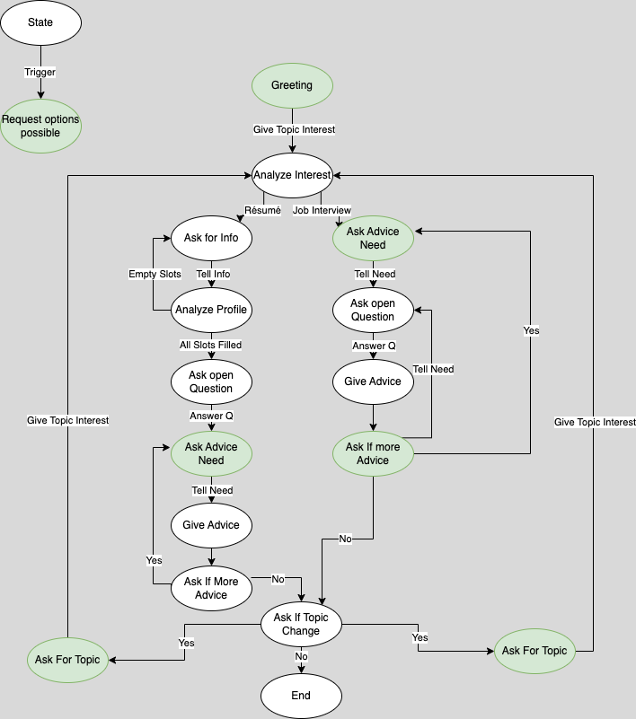

# InterviewRobotSkill

## Description
Furhat gives Advice on two job related topics. Upon entering, the user ist greeted and can choose between two general topics: Résumé and jon interviews.
If they choose résumé, a slot filling sequence consisting of tree slots is entered. The user can give all three required values or a subset as the first response.
It is then checked if a slot remains empty. If an empty slot remains, Furhat asks for the specific slot value to be given. When all slots are filled, Furhat
asks an open question to elicit a longer speech period from the user. After answering that question, 
the user is asked for their advice need. Once answered, Furhat gives advice on the chosen subtopic. After receiving advice, the user can choose to
receive advice on another subtopic. If they do not want this, they are asked if they want to chance the topic. If a topic change is selected, Furhat asks for the desired topic and the
flow begins at the start.\
The job interview topic skips the slot filling subtask. After the topic ist chosen, Furhat asks for the users advice need.
After subtopic selection, an open question is asked. When answered, Furhat gives advice on the subtopic. As with the résumé topic the user can then
choose to receive more advice on a different subtopic, chose a new general topic or end the conversation.\
\
A detailed diagram of the flow can be seen below. To archive readability not all states are pictured and the state names are chosen to represent the 
broader intent rather than the actual names used in the implementation. This decision was made in order to better illustrate the similarities between the two subtopics, which follow slightly
different implementation approaches.

\

## Usage
Max number of users is 1
Default interaction distance is set to: 2 m\
Although the distance is set to 2m, it is advised so sit down in front of Furhat for better speech recognition. See diagram below.\

